# ✈️ Airline Passenger Satisfaction Classification Project
# Module 8: Machine Learning - Classification | Pablo A. Herdener

---

## Problem Statement
Airlines operate in a highly competitive environment where customer experience is a key differentiator. Understanding the drivers of passenger satisfaction can help airlines optimize services, improve operations, and strengthen brand loyalty. This project analyzes an airline passenger satisfaction dataset to:

- Identify the main factors influencing customer satisfaction.
- Explore patterns and insights through exploratory data analysis.
- Build and evaluate classification models that predict if a passenger is either satisfied or is neutral/unsatisfied.
- Provide actionable recommendations for improving customer experience.
- This analysis is valuable for airline customer experience teams, data analysts, and business decision-makers who want data-driven improvements in service quality.

---

## Data Dictionary

The ****Airline Passenger Satisfaction**** dataset contains survey data collected from airline passengers. It includes features such as flight distance, passenger age, seat comfort, and more, with the target variable being the passenger's satisfaction level (satisfied or dissatisfied).

    🗃️ Dataset Reference: 
    
        🌐 <a href="https://www.kaggle.com/datasets/teejmahal20/airline-passenger-satisfaction/data" target="_blank" style="color:#007bff;text-decoration:none">https://www.kaggle.com/datasets/teejmahal20/airline-passenger-satisfaction/data</a>
    
    
        📅 Accessed: Feb 2025
    

The file name is `airline_passenger_satisfaction.csv`. The variables are as follows:

| Column Name                 | Description     |
|-----------------------------|-----------------|
|Gender| Gender of the passengers (Female, Male)|
|Customer Type| The customer type (Loyal customer, disloyal customer)|
|Age| The actual age of the passengers|
|Type of Travel| Purpose of the flight of the passengers (Personal Travel, Business Travel)|
|Class| Travel class in the plane of the passengers (Business, Eco, Eco Plus)|
|Flight distance| The flight distance of this journey|
|Inflight wifi service| Satisfaction level of the inflight wifi service (0:Not Applicable;1-5)|
|Departure/Arrival time convenient| Satisfaction level of Departure/Arrival time convenient|
|Ease of Online booking| Satisfaction level of online booking|
|Gate location| Satisfaction level of Gate location|
|Food and drink| Satisfaction level of Food and drink|
|Online boarding| Satisfaction level of online boarding|
|Seat comfort| Satisfaction level of Seat comfort|
|Inflight entertainment| Satisfaction level of inflight entertainment|
|On-board service| Satisfaction level of On-board service|
|Leg room service| Satisfaction level of Leg room service|
|Baggage handling| Satisfaction level of baggage handling|
|Check-in service| Satisfaction level of Check-in service|
|Inflight service| Satisfaction level of inflight service|
|Cleanliness| Satisfaction level of Cleanliness|
|Departure Delay in Minutes| Minutes delayed when departure|
|Arrival Delay in Minutes| Minutes delayed when Arrival|
|Satisfaction| Airline satisfaction level(Satisfaction, neutral or dissatisfaction)|

---

## Executive Summary

After cleaning and preparing the data, the final dataset contains 97,799 records and 23 variables (22 Features and 1 Target - Satisfaction).

Key Findings:
- There are no missing values in the dataset, except for Arrival Delay in minutes.
- There are no duplicate values.
- The categorical values need to be converted to numeric as described in the data cleaning steps.
- The outliers are possible values within the industry.

### Data Cleaning Steps

- Removed missing values in the arrival delay column.
- Converted categorical variables using one-hot encoding as follows:
    - Gender (Female: 0, Male: 1)
    - Customer Type (disloyal Customer: 0, Loyal Customer: 1)
    - Type of Travel (Personal Travel: 0, Business travel: 1)
    - Class (assume ordinal) (Eco: 1, Eco Plus: 2, Business: 3)
    - satisfaction (neutral or dissatisfied: 0, satisfied: 1)
- Checked for anomalies and outliers in delay-related fields.
    - Most flights have very small delays (median = 0).
    - Few have huge delays (hundreds or >1000 minutes).
    - Outliers are real operational events, such diversions or technical faliures, not errors.
    - However, because KNN uses distances, extreme values will “pull” the distance space and distort neighbors.
    - The Outliers removal will be removing the extreme values up to the 95th percentile.
- Verified class balance 56% for neutral/unsatisfied and 44% for satisfied passengers.
- Scaled continuous variables for KNN and Logistic Regression Models.

### Key Visualizations
They show how the EDA is performed and how the Dataset is prepared to apply the Classification Model to predict the passenger satisfactions.

#### Visualization 1: Boxplots of original dataset Departure and Arrival Delays
Shows initial descriptive statistics and outliers that could bias the Model.

  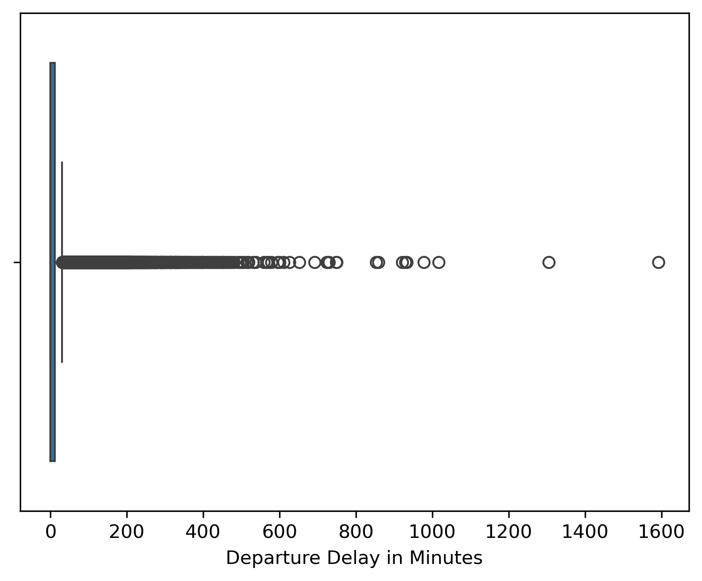
  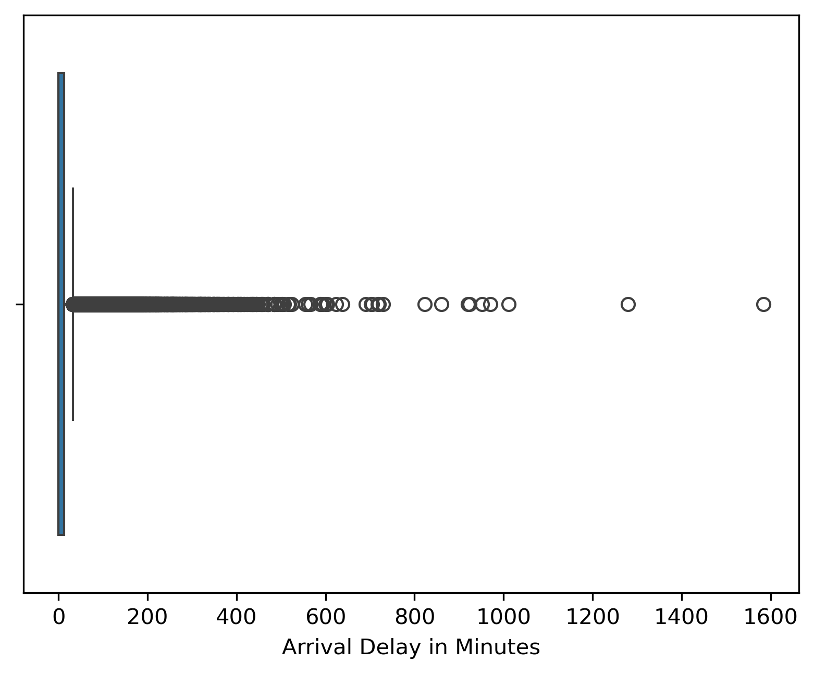

#### Visualization 2: Boxplots after outliers removal of Departure and Arrival Delays
Shows descriptive statistics after removing the outliers up to 95th percentile. Now it's clear to observe that most delays are very short, and the cancellations or diversions are the minimum. In both cases the longest delays will be shorter than 80 minutes, and still the database has almost 98000 rows. Dropping the top 5% still leaves enough for the Models and it will dramatically reduce the skew and extreme-distance issues.

  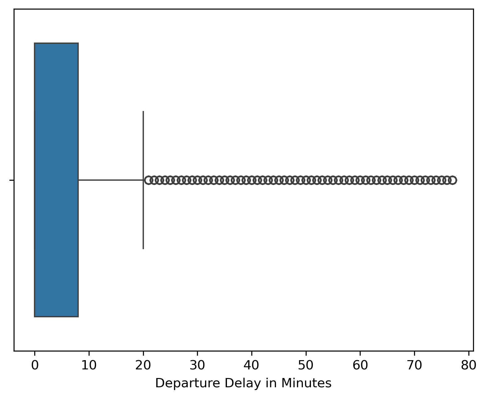
  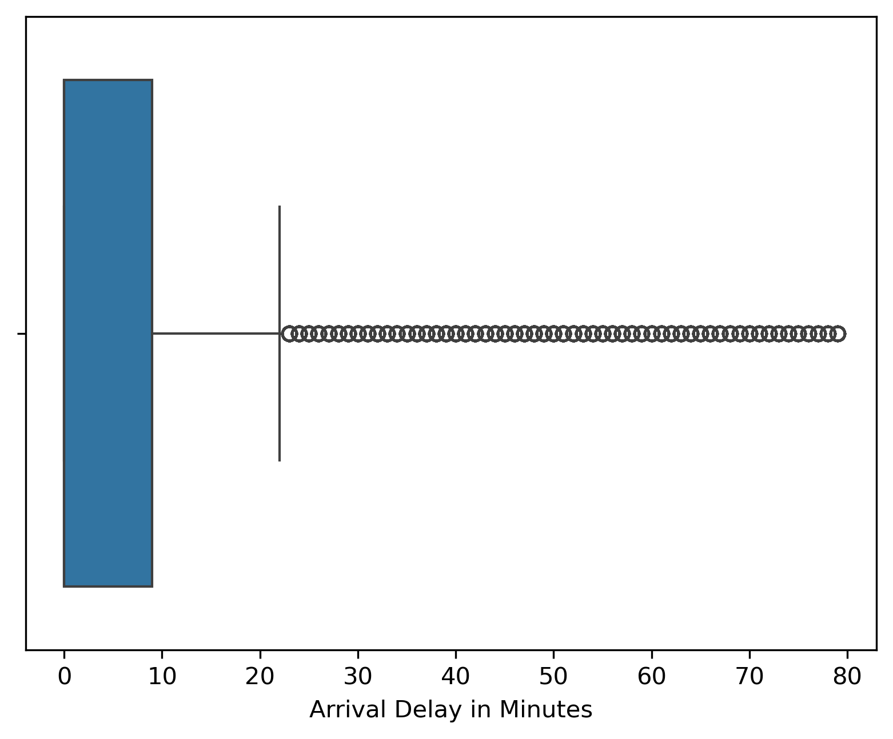

#### Visualization 3: Correlations and Pair Plots of Cleaned Data
Shows the feature correlation with Satisfaction. The Features `Gender` and `Gate location` have the weakest correlation to `satisfaction`. The strongest correlations features are `Online boarding`, `Class`, `Type of Travel`, `Inflight entertainment` and `Seat comfort` and are also shown in the Pair Plot.

- The scatterplots look discrete because the values of the Features are Discrete or Ordinal.
- For KNN, the distance metric will still work fine — the discreteness is just a visualization.
- There are areas where the dots are "redder', indicating dissatisfied customes, or "greener", indicating satisfied customers.
- In general, higher features such Class, Flight Entertainment and Seat Comfort have a higher level of satisfaction.
- Business Travel has also a higher satisfaction level.

  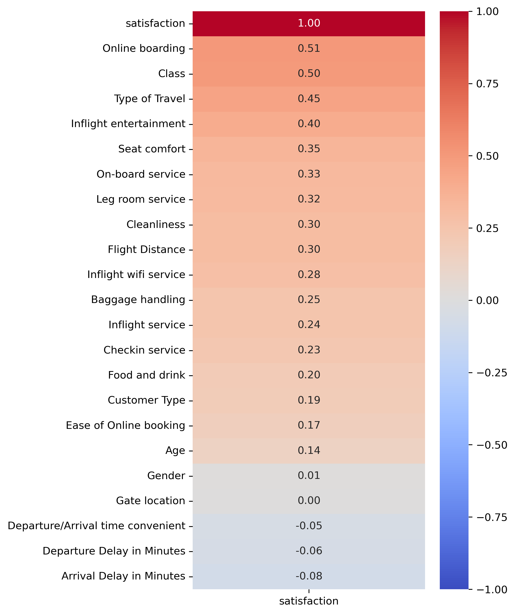
  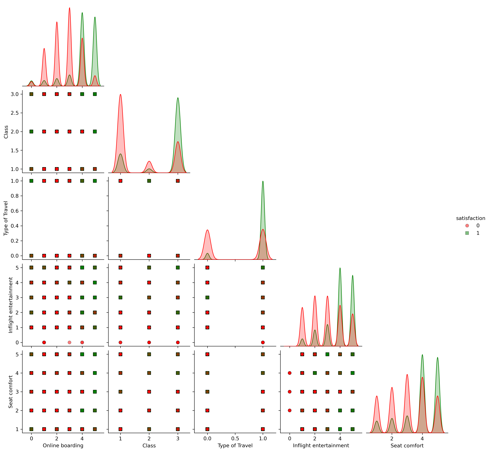

<em>Figure: Correlation Heatmap - Highest Correlations Pair Plots</em>

#### Visualization 4: Class Balance
Shows a cleaned dataset's class balance of 56% for neutral/unsatisfied and 44% for satisfied passengers.

  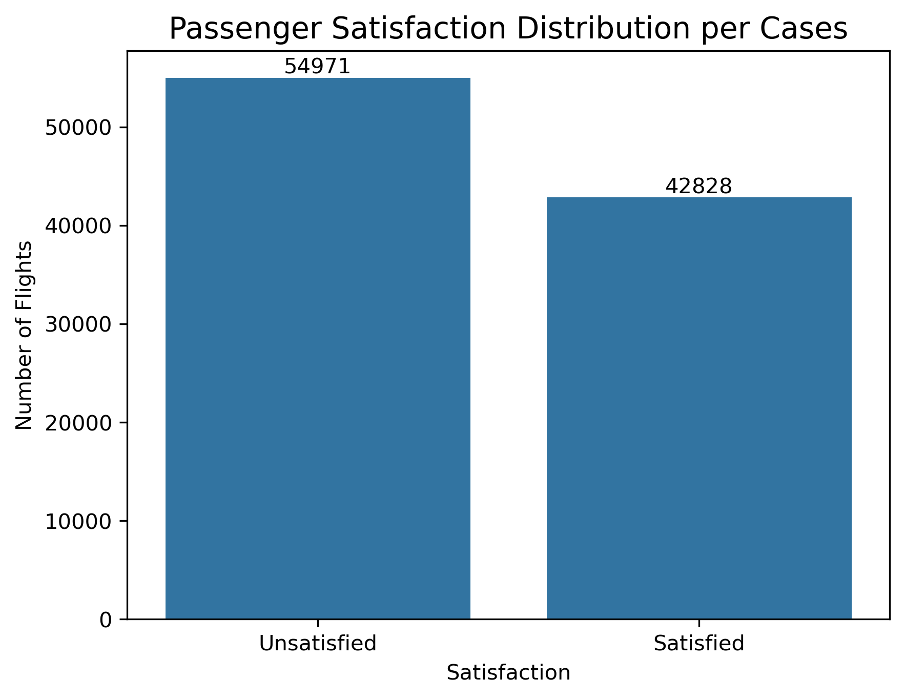

---

## Model Performance

### Model Selection
The project tested several classification algorithms to identify the best model for predicting passenger satisfaction:

- Baseline Accuracy Score of 0.5621.
- KNN with default hyperparameters.
- KNN with optimized hyperparameters.
- Logistic Regression – baseline interpretable model
- Random Forest Classifier – robust for tabular data, handles nonlinearity

### Evaluation Metrics

| Model	         | Accuracy | False Positives | False Negatives | Quick interpretation                    |
|----------------|----------|-----------------|-----------------|-----------------------------------------|
|KNN (k=5)|	0.9263|	525| 1276| Great Accuracy, more FNs than FPs, okay for the business model|
|KNN (k=17)| 0.9280| 430| 1331|	Slightly better accuracy than KNN (default), lower FPs than default k |
|Logistic Regression| 0.8743| 1292|	1693| The worst model in both Accuracy and Errors|
|Random Forest|	0.9625|299|	618| The best model in both Accuracy and Errors|

All models are valid because they beat the Baseline Accuracy Score. Random Forest is the best model, having the highest accuracy and the lowest errors.

### Key Visualizations

#### Visualization 1: KNN Model Confusion Matrix
Shows the Confusion Matrix for default and optimized KNN Models, with False Positives (FP) in the top-right corner and False Negatives (FN) in the top-left corner. The charts also include the Hyperparameter (k) tuning.

  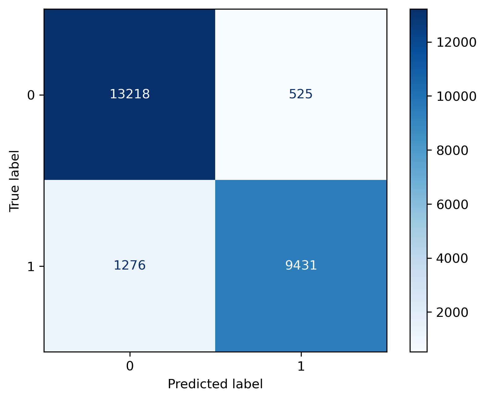
  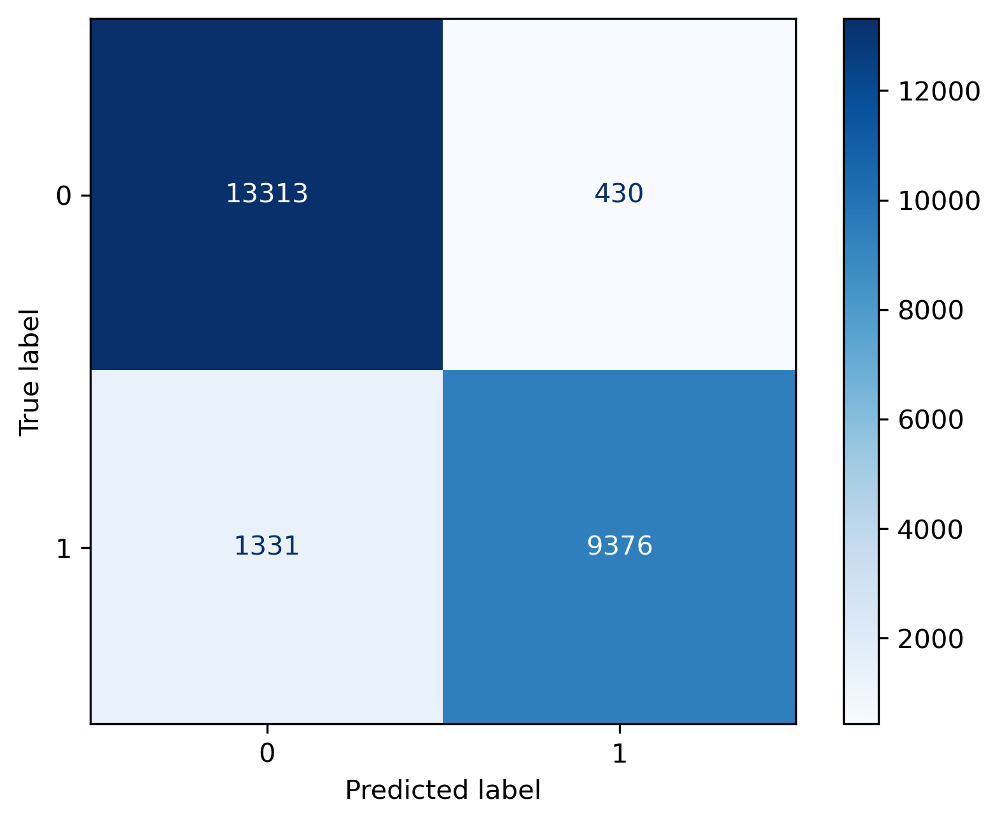
  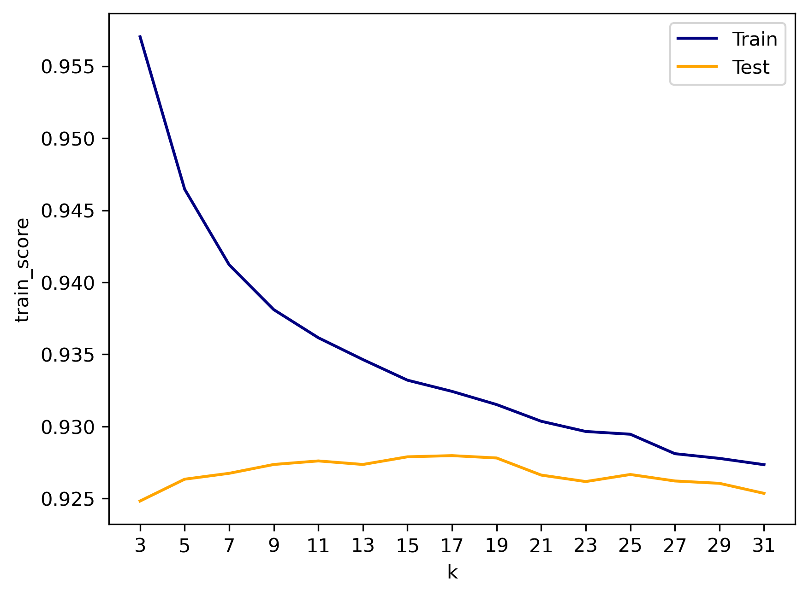

<em>Figure: KNN Model Evaluation — Confusion Matrices (k=5 & k=17) and Hyperparameter Tuning</em>

#### Visualization 2: Logistic Regression Model Confusion Matrix
Shows the Confusion Matrix for the Logistic Regression Model, with False Positives (FP) in the top-right corner and False Negatives (FN) in the top-left corner.

  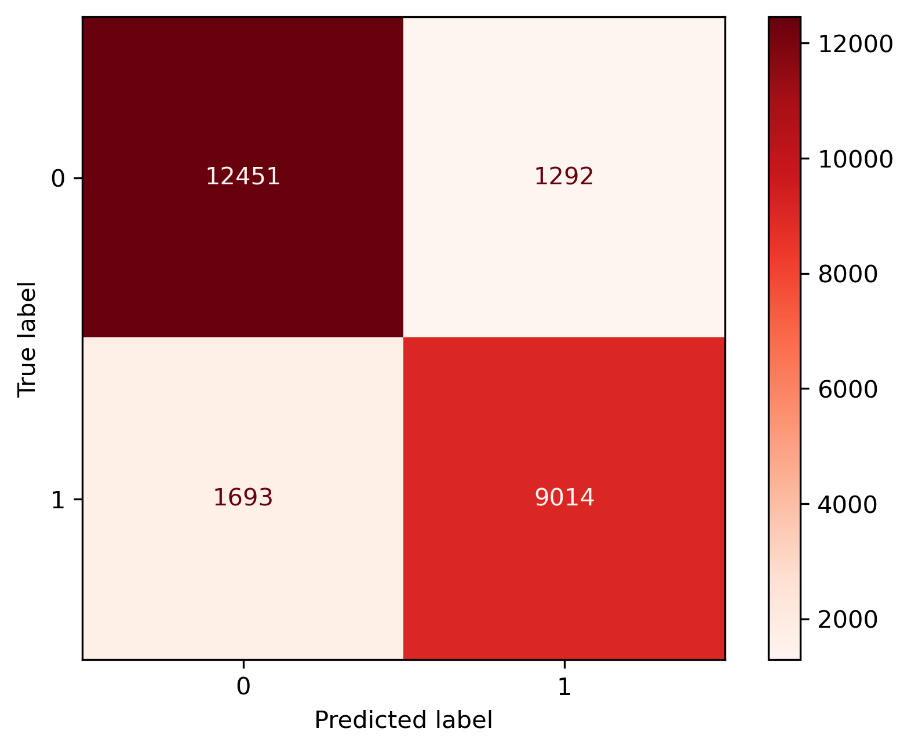
    
#### Visualization 3: Random Forest Model Confusion Matrix
Shows the Confusion Matrix for the Logistic Regression Model, with False Positives (FP) in the top-right corner and False Negatives (FN) in the top-left corner.

  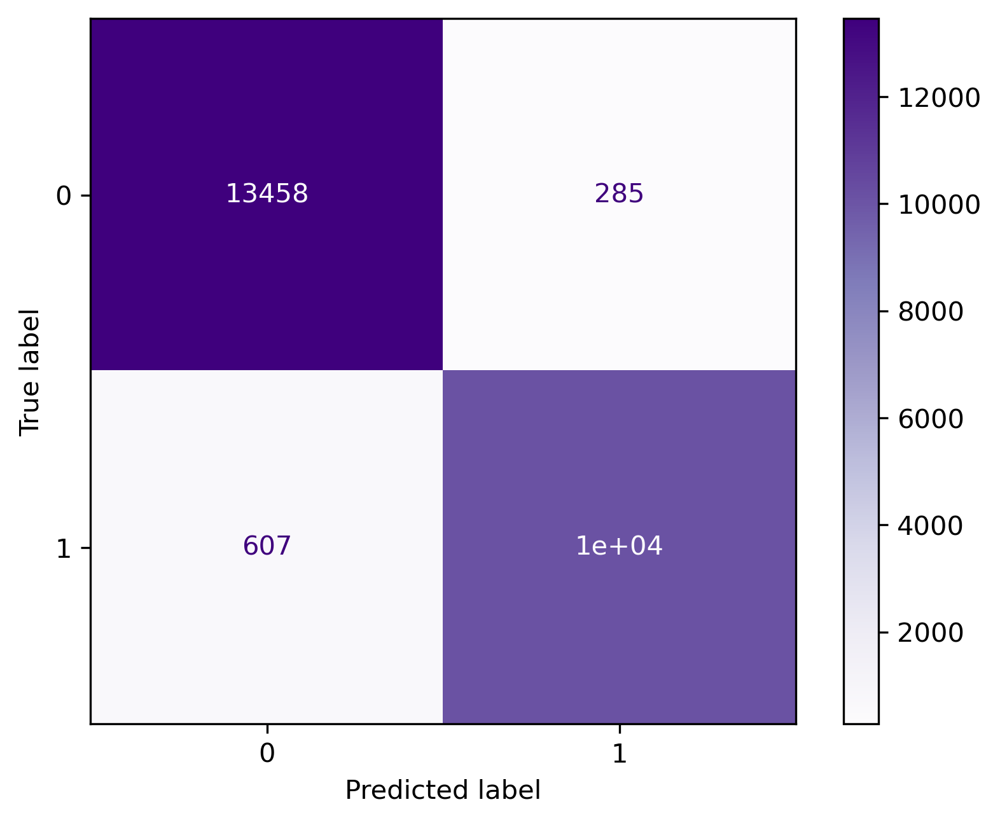

---

## Conclusions/Recommendations

**Conclusions** 
- All models have good Accuracy > 0.87, much better than the 0.52 of the Baseline Model.
- The best model by FN, FP and Accuracy is Random Forest.
- Both KNN models have better scores and accuracy than Logistic Regression.
- Adjusting the k-value on KNN models can increase Accuracy and decreased FPs, desirable for business purposes.
- The analysis explicitly states the model’s strong performance relative to baseline.
- It ties the FN vs FP pattern to business impact, not arbitrary preference.
- It also frames FN as “unnecessary but harmless,” and FP as “risky,” which is usually accurate for customer-experience applications and justifies keeping the model despite the imbalance between FNs and FPs.

---

**Recommendations**
- Analyze the cost of handling the highest correlated features with satisfaction, such online boarding, inflight entertainment and seat comfort, especially for Eco class.
- Improve boarding process efficiency.
- Invest in seat comfort and inflight entertainment upgrades.
- Enhance consistency in on-board service interactions.
- Improve as much as possible the above features for Eco and Eco Plus classes.
- Compare the cost of these measures to the potential revenue loss of unsatisfied passengers.

## Additional Information

- Libraries used in Python: Pandas, NumPy, Scikit-learn, Matplotlib, Seaborn.
- Dataset source: [https://www.kaggle.com/datasets/teejmahal20/airline-passenger-satisfaction/data]
- Streamlit Application Link: [https://airline-app-app-sbbzbo6svoetsyam6ekv4w.streamlit.app/%5D]
- For full analysis, refer to the accompanying Jupyter notebooks in the repository.
- Author: Pablo A. Herdener
- Date: November 2025
